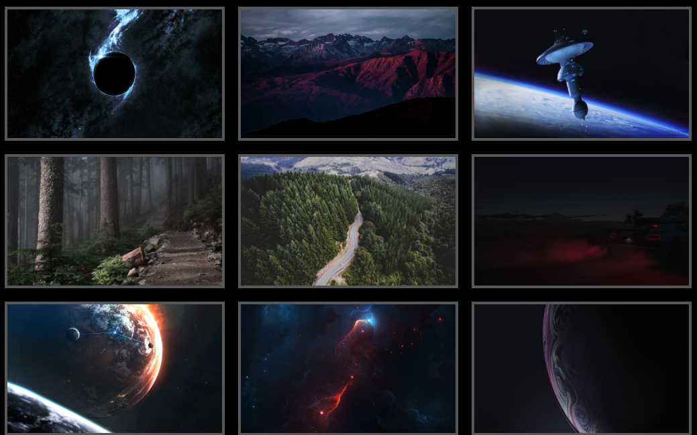
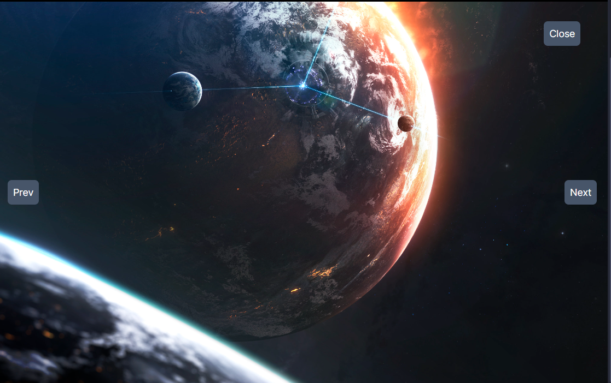

This is a [Next.js](https://nextjs.org/) project bootstrapped with [`create-next-app`](https://github.com/vercel/next.js/tree/canary/packages/create-next-app).

## What is this?
An app that holds an interactive photo gallery in a responsive grid. Each image has a click event that opens a modal of the image in front of the page. The modal can close and change image.

### Method
Create a component that will handle the Gallery itself,
pass the image data with a loop to create each image.
Give each image a click event that passes the image data to a useState. The modal is another component called as a conditional render, that only opens if the useState has a selected image. Inside the modal we crete three buttons that each calls a function that changes the useState of selected image.

Exercise from b7web course

